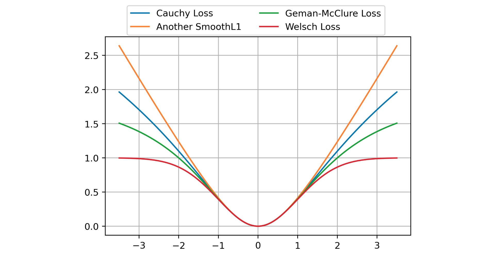

# Does implying robust loss always help?

## Learning a custom classifier for CIFAR10 Dataset based on Variational Autoencoder embeddings

The VAE and VQ-VAE algoritms were tested on CIFAR10 Dataset, the best of two is VAE due to its higher performance with all
loss functions, the latent dim of VAE is set to 128 as its dim is the best among tested ([64, 128, 256, 512])

As the experiment, a number of robust loss functions were compared to each other and with the standard MSE Loss

    

Which realizations can be found in 'blocks.py'

### For comparing I used visualization of the hidden representation of the validaition dataset with Multidimensional Scaling

    

    

    
</p

In conclusion, there should be balancing with robustness in functions we optimize.

## Classification task
As for classifier, it is an MLP that takes a reparametrized latent vector (as stated in [2]), which is
defined through standard deviation and mean learned by the autoencoder. CrossEntropy was used as the loss function and 
accuracy was chosen as the leading metric as train and test datasets of cifar10 are ideally balanced

### Results
| VAE Loss  | accuracy | loss |
| ------------- | ------------- | ------------- |
| Geman-McClure  |  0.54  | 1.58 |
| MSE+KL         |  0.61  | 1.41 |
| Cauchy         |  **0.78** | **0.89** |
| SmoothL1       |  0.67  | 1.30 |
| Welsch         |  0.33 | 1.88 |

## References
[1] Barron et al. (2019). A General and Adaptive Robust Loss Function: https://arxiv.org/abs/1701.03077
[2] Kingma, Welling et al. (2013). Auto-Encoding Variational Bayes: https://arxiv.org/abs/1312.6114
